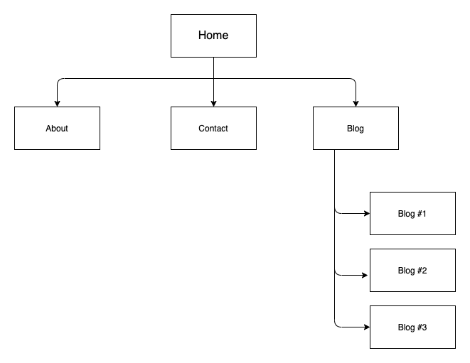
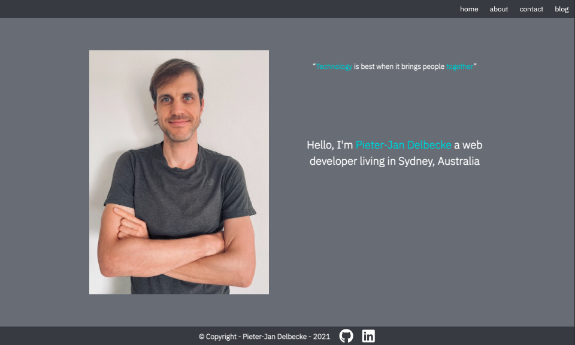
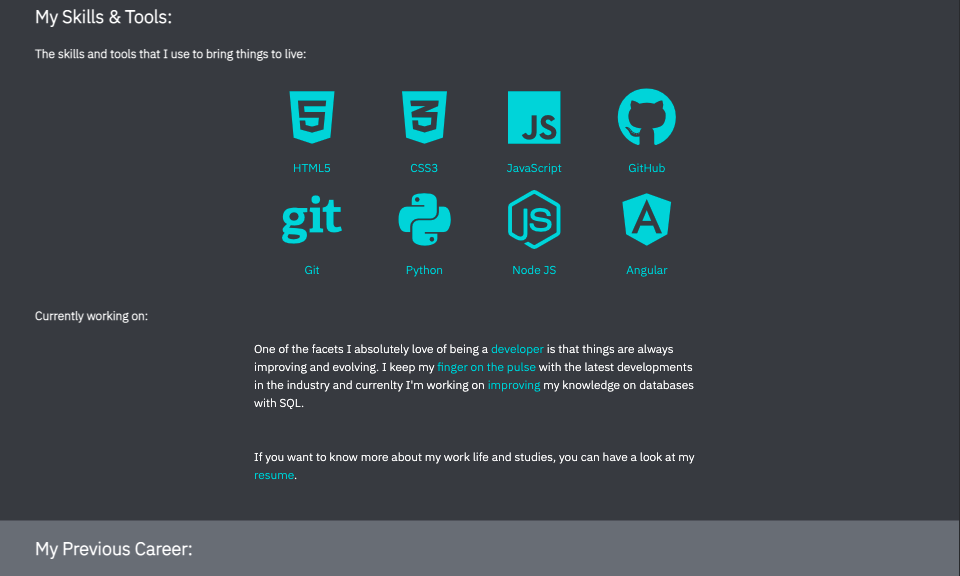
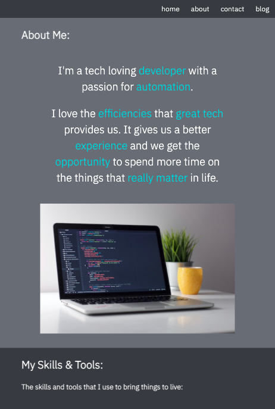
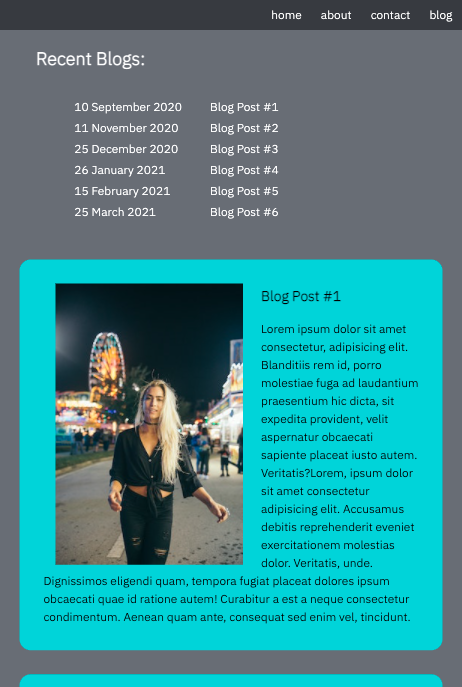
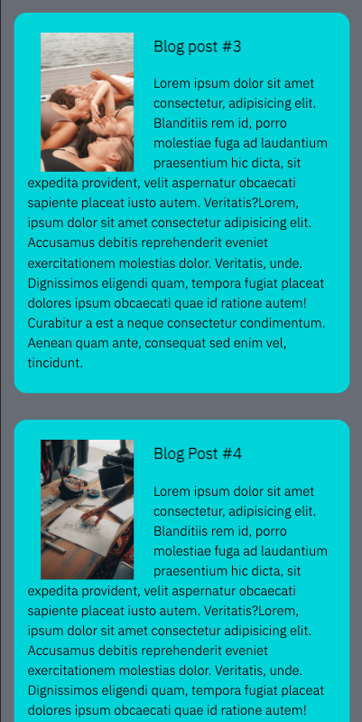
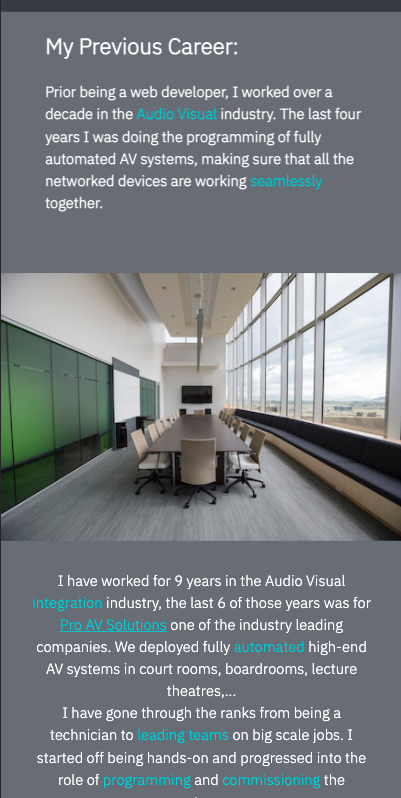
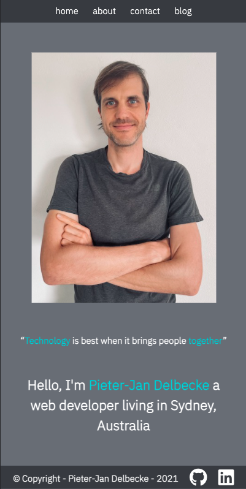

# Portfolio - Pieter-Jan Delbecke

## Links

[portfolio-website] (https://silly-elion-b742cf.netlify.app/index.html)
[Github] (https://github.com/PieterJanDelbecke/portfolio)

## Description

With this portfolio I want to show potential future employers who I am and what I can do as a web developer.

The site contains four pages as shown on the sitemap: 

 

- **Home Page:** page with a picture of me and a quick intro.
- **About Page:** page where I introduce myself and I talk about my skills/tools as a web developer. I also have a part that addresses my previous work life.
- **Contact Page:** page with all my contact details and socials.
- **Blog Page:** page with blog posts I have written.

## Tech Stack

- HTML
- CSS

## Screenshots

### Browser:

### iPad:

### iPhone:

